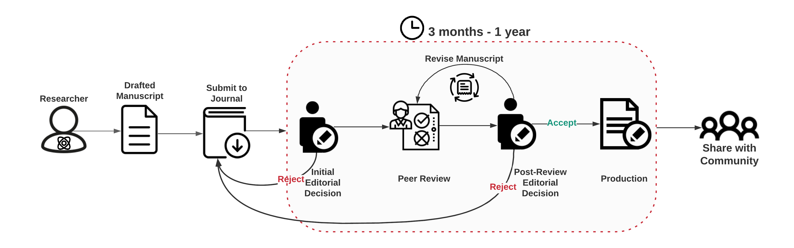
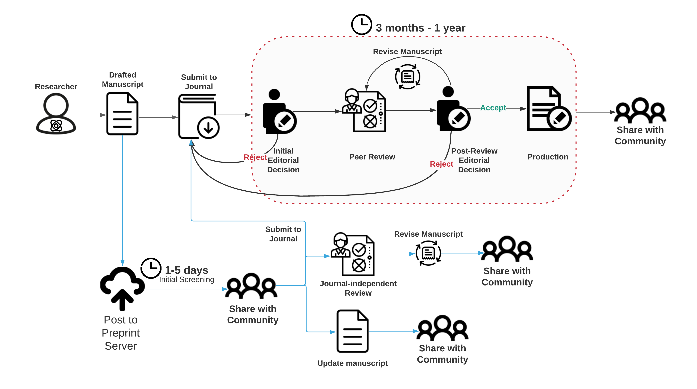

   **Title:** Introduction to the evolving publication landscape

**Main/Overall Objective:** The overall objective of this lesson is to: 1) introduce the importance of communication in achieving scientific progress (what is the purpose of publishing?), the history behind the scientific publication system (how did the current publishing process start?), and the current, traditional journal-based publication process (how does the current publishing process work?); 2) discuss challenges in the current, traditional journal-based publication process and introduce emerging innovations in scientific communication, such as preprinting, that provide solutions to these challenges and, finally 3) introduce how these new approaches to scientific communication can integrate with the traditional, journal-based publication process. Additionally, the full scope and goals of the course will be discussed as an introduction to the topics covered in the subsequent lessons. The end of the lesson presents a discussion to understand each student’s experience with the publication process and poses a thought experiment discussion to promote critical thinking and independent problem solving to the challenges in the current traditional publication process.

**Section Content:**

1. **Overview of the lesson and ‘things you should know’**
2. **The importance of communication in scientific progress**
    1. Scientific progress as a collective endeavor
        1. Connected papers exercise
    2. CRISPR gene editing revolution required effective communication over time and space
    3. Thought experiment: does more communication lead to more scientific progress?
3. **The history of scientific communication and how the current, journal-based publication process works**
    1. Origins and evolution of the academic journal
    2. Traditional communication through academic publishers and scientific journals
    3. Introduction to key steps in the current traditional, journal-based publication process
4. **Challenges within the current publication system**
    1. Increases in time to publication – authors and the process
    2. The rising costs to publish in academic journals
    3. The rising costs of subscriptions to access scientific progress in journals
    4. Unintended consequences: What is the impact to scientific progress? – CRISPR example
5. **Emerging solutions and innovations in scientific communication**
    1. Publishing in the digital age
    2. New approaches the publishing: preprint servers
    3. New approaches to peer review
    4. Transitioning: Integration of new approaches with the traditional, journal-dependent publication process
6. **Introduction to the lessons of the course**
7. **Discussion #1:** What has your experience been (good and bad) with the traditional, journal-based process?
8. **Discussion #2: **How might you design a communication process to advance scientific progress?**  **
9. **Brief Survey *****_Under Construction_***

**Materials:**

1. PowerPoint slides
    1. Purpose: Prepared slides as a basis to design the lesson.
    2. Link to [Slides](./Intro_Slides_052221.pdf) (Or alternatively in [Google Drive](https://docs.google.com/presentation/d/1sdJOiB-qUBY9PDHmymHrAxmabq_jVd2qZNF7S0Syc-I/edit?usp=sharing))
2. Manuscript Lifecyle illustrations
    1. Purpose: Visual aid to introduce the current publication process and broad topics of course. V2 presents preprinting and additional innovations as additional steps in the process.
    2. V1 Description: Visualization of the traditional, journal-based publication process: 
    3. V2 Description: Preprinting + the traditional, journal-based publication process:
3. Brief Survey ***_Under Construction_***
    * Purpose: To assess understanding of the major concepts introduced in the lesson

**Lesson plan (~75 minutes):**

Order/flow of lesson - the suggested order of doing things and associated materials for each section. Blocks are suggested for lessons with shorter durations (~30 mins).

<table>
  <tr>
   <td>Blocks
   </td>
   <td>Time
   </td>
   <td>Content
   </td>
   <td>Suggested materials
   </td>
   <td>Additional resources
   </td>
  </tr>
  <tr>
   <td rowspan="3" >30 minutes
   </td>
   <td>5 minutes
   </td>
   <td>Overview of the lesson and ‘things you should know’
   </td>
   <td>PPT
   </td>
   <td>
   </td>
  </tr>
  <tr>
   <td>10 minutes
   </td>
   <td>The importance of communication in scientific progress
   </td>
   <td>PPT
   </td>
   <td><a href="www.connectedpapers.com">www.connectedpapers.com</a>
   </td>
  </tr>
  <tr>
   <td>10 minutes
   </td>
   <td>The history of scientific communication and the traditional, journal-based publication process works
   </td>
   <td>PPT

Manuscript lifecycle illustration_V1
   </td>
   <td>
   </td>
  </tr>
  <tr>
   <td rowspan="3" >30 minutes
   </td>
   <td>10 minutes
   </td>
   <td>Challenges within the current publication system
   </td>
   <td>PPT

Manuscript lifecycle illustration_V1
   </td>
   <td>
   </td>
  </tr>
  <tr>
   <td>10 minutes
   </td>
   <td>Emerging solutions and innovations in scientific communication
   </td>
   <td>PPT

Manuscript lifecycle illustration_V2
   </td>
   <td>
   </td>
  </tr>
  <tr>
   <td>5 minutes
   </td>
   <td>Introduction to the lessons of the course
   </td>
   <td>PPT
   </td>
   <td>
   </td>
  </tr>
  <tr>
   <td rowspan="3" >35 minutes
   </td>
   <td>15 minutes
   </td>
   <td>Discussion #1
   </td>
   <td>
   </td>
   <td>
   </td>
  </tr>
  <tr>
   <td>15 minutes
   </td>
   <td>Discussion #2
   </td>
   <td>
   </td>
   <td>
   </td>
  </tr>
  <tr>
   <td>5 minutes
   </td>
   <td>Brief Survey
   </td>
   <td>Survey
   </td>
   <td>
   </td>
  </tr>
</table>

**Reflection:**

1. Discussion #1: What has your experience been (good and bad) with the traditional, journal-based process?
2. Discussion #2: How might you design a communication process to advance scientific progress?
3. Brief Survey ***_Under Construction_***

**Resources:**

1. [https://doi.org/10.1016/j.cell.2015.12.041](https://doi.org/10.1016/j.cell.2015.12.041)
2. [https://blogs.scientificamerican.com/information-culture/the-birth-of-modern-peer-review/](https://blogs.scientificamerican.com/information-culture/the-birth-of-modern-peer-review/)
3. [https://www.aje.com/arc/scholarly-publishing-brief-history/](https://www.aje.com/arc/scholarly-publishing-brief-history/)
4. [https://zenodo.org/record/546100#.YAgV3ZNKjMJ](https://zenodo.org/record/546100#.YAgV3ZNKjMJ)
5. [https://doi.org/10.1002/9781118620762.ch27](https://doi.org/10.1002/9781118620762.ch27)
6. [https://jamanetwork.com/journals/jama/article-abstract/202114](https://jamanetwork.com/journals/jama/article-abstract/202114)
7. [https://doi.org/10.3389/fncom.2012.00019](https://doi.org/10.3389/fncom.2012.00019)

**Author:**

Tara Fischer

Email: [tfisch17@gmail.com](mailto:tfisch17@gmail.com)

Please contact for further questions or issues with the lesson material.
